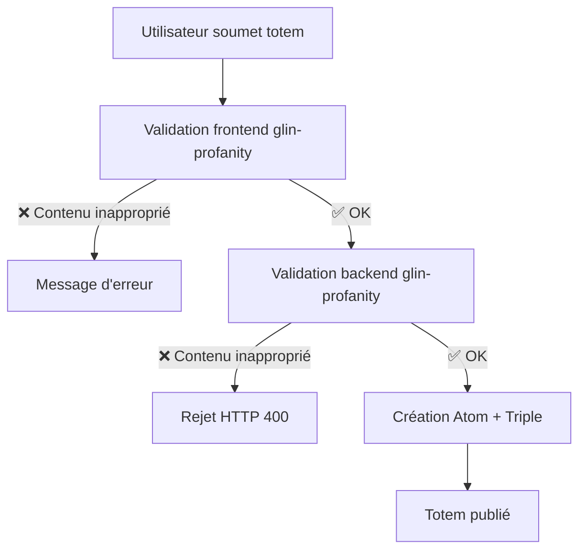
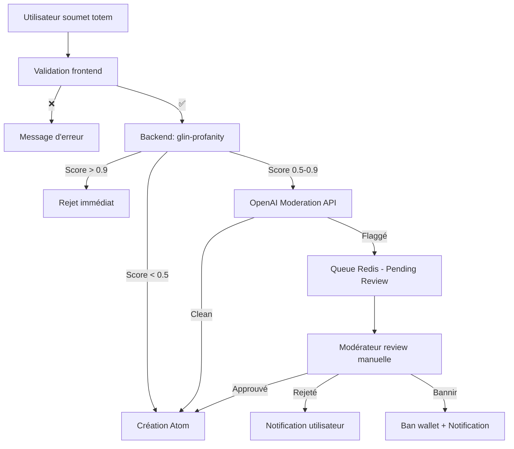

# 🛡️ Modération du Contenu - INTUITION Founders Totem

**Date de création** : 18 novembre 2025
**Dernière mise à jour** : 18 novembre 2025
**Statut** : ✅ Complet

---

## 📋 Table des matières

1. [Introduction](#-introduction)
2. [Enjeux et risques](#-enjeux-et-risques)
3. [Stratégie de modération](#-stratégie-de-modération)
4. [Solutions techniques](#-solutions-techniques)
5. [Implémentation recommandée](#-implémentation-recommandée)
6. [Workflow de modération](#-workflow-de-modération)
7. [Interface de modération manuelle](#-interface-de-modération-manuelle)
8. [Coûts et maintenance](#-coûts-et-maintenance)
9. [Conformité légale](#-conformité-légale)
10. [Plan d'implémentation](#-plan-dimplémentation)

---

## 🎯 Introduction

La plateforme INTUITION Founders Totem permet aux utilisateurs de proposer des totems (objets, animaux, traits, énergies) pour représenter les 42 fondateurs. Cette liberté créative nécessite un système de modération robuste pour :

- **Protéger la réputation** des fondateurs et d'INTUITION
- **Maintenir un environnement respectueux** pour la communauté
- **Éviter le contenu offensant** (insultes, propos haineux, contenu sexuel inapproprié, etc.)
- **Se conformer aux réglementations** (GDPR, Digital Services Act, etc.)

### 🎯 Objectifs de la modération

1. **Prévention** : Bloquer le contenu inapproprié avant publication
2. **Détection** : Identifier automatiquement le contenu suspect
3. **Action** : Workflow manuel pour valider ou rejeter les contenus flaggés
4. **Transparence** : Notifier les utilisateurs des décisions de modération
5. **Apprentissage** : Améliorer le système au fil du temps

---

## ⚠️ Enjeux et risques

### Risques identifiés

| Risque | Gravité | Probabilité | Impact |
|--------|---------|-------------|---------|
| **Insultes envers les fondateurs** | 🔴 Critique | Moyenne | Réputation, légal |
| **Contenu haineux / discriminatoire** | 🔴 Critique | Faible | Légal, bannissement |
| **Spam et publicité** | 🟡 Modérée | Élevée | Qualité, UX |
| **Contenu sexuel explicite** | 🔴 Critique | Faible | Réputation, légal |
| **Contournement de filtres (l33t, espaces)** | 🟡 Modérée | Moyenne | Qualité |
| **Faux positifs (blocages légitimes)** | 🟡 Modérée | Moyenne | UX, frustration |

### Types de contenu à modérer

#### 1. **Langage offensant**
- Insultes, jurons
- Propos haineux (racisme, sexisme, homophobie, etc.)
- Harcèlement et menaces

#### 2. **Contenu sexuel**
- Contenu pornographique ou explicite
- Références sexuelles inappropriées
- Harcèlement sexuel

#### 3. **Spam et abus**
- Publicité non sollicitée
- Liens suspects ou malveillants
- Contenu répétitif

#### 4. **Désinformation**
- Fausses informations sur les fondateurs
- Usurpation d'identité

#### 5. **Contournement**
- L33t speak (l0l, 4ss, etc.)
- Espaces entre lettres (a s s)
- Caractères Unicode similaires

---

## 🎯 Stratégie de modération

Nous adoptons une **approche hybride** combinant :

### 1. **Modération automatique (Tier 1)**
- Filtrage en temps réel des mots interdits
- Détection d'obfuscation (l33t, espaces)
- Analyse de sentiment et toxicité (optionnel)

### 2. **Modération semi-automatique (Tier 2)**
- Mise en file d'attente des contenus suspects
- Notation de confiance (score de toxicité)
- Priorisation des cas urgents

### 3. **Modération manuelle (Tier 3)**
- Review humaine des contenus flaggés
- Décisions finales : Approuver / Rejeter / Bannir
- Feedback pour améliorer les filtres

### 4. **Modération communautaire (Tier 4 - Futur)**
- Système de signalement par les utilisateurs
- Votes communautaires
- Réputation des modérateurs

---

## 🛠️ Solutions techniques

### Comparaison des approches

| Approche | Avantages | Inconvénients | Coût | Recommandation |
|----------|-----------|---------------|------|----------------|
| **Listes de mots (npm packages)** | ✅ Gratuit<br>✅ Simple<br>✅ Multilingue<br>✅ Offline | ⚠️ Faux positifs<br>⚠️ Contournement facile<br>⚠️ Maintenance | $0 | ✅ **OUI - Base** |
| **IA/NLP (OpenAI, Perspective API)** | ✅ Contexte<br>✅ Précision<br>✅ Détection subtile | ⚠️ Coût API<br>⚠️ Latence<br>⚠️ Dépendance externe | $10-100/mois | 🟡 **Optionnel - Phase 2** |
| **AWS Comprehend Toxicity** | ✅ Intégration AWS<br>✅ 7 catégories<br>✅ Scores de confiance | ⚠️ Anglais uniquement<br>⚠️ Coût<br>⚠️ Faux positifs SEXUAL | $0.0001/unité | 🟡 **Optionnel** |
| **Custom ML Model** | ✅ Personnalisé<br>✅ Pas de coût API | ⚠️ Complexité extrême<br>⚠️ Maintenance<br>⚠️ Dataset | $0 (mais temps) | ❌ **NON - Overkill** |

---

## 📦 Packages npm recommandés

### 🥇 Option 1 : **glin-profanity** (Recommandé)

**Pourquoi ?**
- ✅ **20+ langues** (FR, EN inclus)
- ✅ **Détection d'obfuscation** (l33t, espaces, Unicode)
- ✅ **Niveaux de sévérité** (faible, modéré, sévère)
- ✅ **TypeScript natif**
- ✅ **Hooks React** disponibles
- ✅ **Actif et maintenu**

**Installation** :
```bash
pnpm add glin-profanity
```

**Usage** :
```typescript
import { ProfanityEngine } from 'glin-profanity';

const profanityEngine = new ProfanityEngine({
  languages: ['en', 'fr'],
  grawlixChar: '*',
  sensitivity: 'high', // low, medium, high
  obfuscationDetection: true
});

const result = profanityEngine.analyze('texte à analyser');

console.log(result.isProfane); // true/false
console.log(result.score); // 0-1
console.log(result.matches); // Mots détectés
console.log(result.severity); // mild, moderate, severe
```

**Avec React** :
```typescript
import { useProfanityFilter } from 'glin-profanity/react';

function TotemForm() {
  const { checkText, isProfane, censorText } = useProfanityFilter({
    languages: ['en', 'fr'],
    sensitivity: 'high'
  });

  const handleSubmit = (name: string) => {
    if (isProfane(name)) {
      toast.error('Le nom contient du contenu inapproprié');
      return;
    }
    // Soumettre...
  };
}
```

---

### 🥈 Option 2 : **@2toad/profanity**

**Pourquoi ?**
- ✅ **TypeScript natif**
- ✅ **Multi-langues** (EN, FR, DE)
- ✅ **Simple et léger**
- ✅ **Whitelist** (exceptions)

**Installation** :
```bash
pnpm add @2toad/profanity
```

**Usage** :
```typescript
import { profanity } from '@2toad/profanity';

profanity.setLanguages(['en', 'fr']);

profanity.exists('texte'); // true/false
profanity.censor('texte'); // Remplace par ***
profanity.whitelist(['Phoenix', 'Arsenal']); // Exceptions
```

---

### 🥉 Option 3 : **leo-profanity**

**Pourquoi ?**
- ✅ **Multi-langues** (EN, FR, RU)
- ✅ **Basé sur Shutterstock dictionary**
- ✅ **Dictionnaires personnalisables**
- ✅ **Populaire** (500k+ téléchargements/semaine)

**Installation** :
```bash
pnpm add leo-profanity
```

**Usage** :
```typescript
import * as filter from 'leo-profanity';

filter.loadDictionary('fr');
filter.check('texte'); // true/false
filter.clean('texte'); // Nettoie
filter.add(['motperso']); // Ajouter mots
filter.remove(['faux-positif']); // Supprimer mots
```

---

### 🤖 Option 4 : **content-checker** (AI-powered)

**Pourquoi ?**
- ✅ **Détection contextuelle** avec LLM
- ✅ **Variantes de mots** détectées
- ✅ **Intentions malveillantes** détectées
- ✅ **TypeScript + ES6**

**Installation** :
```bash
pnpm add content-checker
```

**Usage** :
```typescript
import { ContentChecker } from 'content-checker';

const checker = new ContentChecker({
  useAI: true, // Utilise LLM pour contexte
  apiKey: process.env.OPENAI_API_KEY // Optionnel
});

const result = await checker.checkText('texte à analyser');

console.log(result.isClean); // true/false
console.log(result.issues); // Liste des problèmes détectés
```

⚠️ **Note** : Nécessite une API key OpenAI si `useAI: true` → Coût API.

---

## 🔧 APIs de modération (Optionnel - Phase 2)

### 🌐 Perspective API (Google Jigsaw)

**Pourquoi ?**
- ✅ **Gratuit** pour usage modéré
- ✅ **18 langues** supportées
- ✅ **Score de toxicité** (0-1)
- ✅ **Utilisé par NYT, Reddit, WSJ**
- ✅ **2 milliards d'analyses/jour**

**Limitations** :
- ⚠️ 100ms de latence par requête
- ⚠️ Faux positifs/négatifs possibles
- ⚠️ Quota API à vérifier

**Obtenir une API key** :
1. Aller sur https://perspectiveapi.com/
2. Créer un projet Google Cloud
3. Activer Perspective API
4. Copier l'API key

**Usage** :
```typescript
import { PerspectiveAPI } from '@conversationai/perspectiveapi-js-client';

const client = new PerspectiveAPI({
  apiKey: process.env.PERSPECTIVE_API_KEY
});

const result = await client.analyze({
  comment: { text: 'texte à analyser' },
  languages: ['fr', 'en'],
  requestedAttributes: {
    TOXICITY: {},
    SEVERE_TOXICITY: {},
    IDENTITY_ATTACK: {},
    INSULT: {},
    PROFANITY: {},
    THREAT: {}
  }
});

const toxicityScore = result.attributeScores.TOXICITY.summaryScore.value;

if (toxicityScore > 0.7) {
  // Contenu suspect
}
```

**Catégories disponibles** :
- `TOXICITY` : Toxicité générale
- `SEVERE_TOXICITY` : Toxicité sévère
- `IDENTITY_ATTACK` : Attaque identitaire
- `INSULT` : Insulte
- `PROFANITY` : Langage grossier
- `THREAT` : Menace
- `OBSCENE` : Obscène (expérimental)
- `SPAM` : Spam (expérimental)

---

### ☁️ AWS Comprehend Toxicity Detection

**Pourquoi ?**
- ✅ **7 catégories** spécifiques
- ✅ **Scores de confiance**
- ✅ **Intégration AWS native**

**Limitations** :
- ⚠️ **Anglais uniquement** (dealbreaker pour FR)
- ⚠️ Faux positifs sur SEXUAL
- ⚠️ Coût : $0.0001/unité (100 caractères)

**Catégories** :
1. PROFANITY (jurons)
2. HATE_SPEECH (discours haineux)
3. INSULT (insultes)
4. GRAPHIC (violence graphique)
5. HARASSMENT_OR_ABUSE (harcèlement)
6. SEXUAL (contenu sexuel)
7. VIOLENCE_OR_THREAT (violence/menaces)

**Usage** :
```typescript
import { ComprehendClient, DetectToxicContentCommand } from '@aws-sdk/client-comprehend';

const client = new ComprehendClient({ region: 'us-east-1' });

const command = new DetectToxicContentCommand({
  TextSegments: [
    { Text: 'texte à analyser' }
  ],
  LanguageCode: 'en'
});

const response = await client.send(command);

const toxicityScore = response.ResultList[0].Toxicity;
const labels = response.ResultList[0].Labels; // PROFANITY, INSULT, etc.
```

**Verdict** : ❌ **Non recommandé** car pas de support français.

---

### 🤖 OpenAI Moderation API

**Pourquoi ?**
- ✅ **Gratuit** (pour les clients OpenAI)
- ✅ **Contextuel** et précis
- ✅ **Multilingue** (détection automatique)
- ✅ **Catégories détaillées**

**Catégories** :
- `hate` : Contenu haineux
- `hate/threatening` : Menaces haineuses
- `harassment` : Harcèlement
- `harassment/threatening` : Harcèlement menaçant
- `self-harm` : Auto-mutilation
- `sexual` : Contenu sexuel
- `sexual/minors` : Contenu impliquant des mineurs
- `violence` : Violence
- `violence/graphic` : Violence graphique

**Usage** :
```typescript
import OpenAI from 'openai';

const openai = new OpenAI({
  apiKey: process.env.OPENAI_API_KEY
});

const moderation = await openai.moderations.create({
  input: 'texte à analyser'
});

const result = moderation.results[0];

console.log(result.flagged); // true/false
console.log(result.categories); // Catégories détectées
console.log(result.category_scores); // Scores (0-1)

if (result.categories.hate || result.categories.harassment) {
  // Bloquer
}
```

**Coût** :
- ✅ **Gratuit** si vous utilisez déjà OpenAI
- ⚠️ Sinon : $0.02/1000 tokens (très abordable)

---

## 🏆 Implémentation recommandée

### Phase 1 : MVP (Gratuit)

**Stack** :
- **Frontend** : `glin-profanity` avec React hooks
- **Backend** : `glin-profanity` pour validation serveur
- **Détection** : Obfuscation + sensibilité haute
- **Langues** : Français + Anglais

**Workflow** :
1. ✅ Utilisateur saisit le nom du totem
2. ✅ Validation frontend en temps réel (feedback instant)
3. ✅ Validation backend avant création Atom
4. ✅ Si flaggé : Rejet avec message clair
5. ✅ Si OK : Création Atom + Triple

**Coût** : **$0/mois**

---

### Phase 2 : Production (Optionnel)

**Stack** :
- **Frontend** : `glin-profanity` (filtrage rapide)
- **Backend** : `glin-profanity` + **OpenAI Moderation API** (double validation)
- **Détection** : Obfuscation + contexte + intentions
- **Queue** : Redis pour contenus suspects
- **Dashboard** : Interface de modération manuelle

**Workflow amélioré** :
1. ✅ Utilisateur saisit le nom du totem
2. ✅ Validation frontend (`glin-profanity`)
3. ✅ Validation backend Tier 1 (`glin-profanity`)
4. ✅ Si flaggé : Rejet immédiat
5. 🔄 Si limite (score 0.5-0.7) : OpenAI Moderation API
6. 🔄 Si OpenAI flagge : Mise en queue de modération
7. 👤 Review manuelle : Approuver / Rejeter
8. ✅ Si OK : Création Atom + Triple

**Coût estimé** :
- OpenAI Moderation : ~$1-5/mois (pour 10k propositions)
- Redis : Gratuit (Render ou Upstash Free)
- **Total** : **~$5/mois**

---

## 🔍 Implémentation technique

### 1. Schema de validation Zod (Frontend + Backend)

```typescript
// shared/validation/totem.schema.ts
import { z } from 'zod';
import { profanity } from '@2toad/profanity';

profanity.setLanguages(['en', 'fr']);

export const TotemNameSchema = z.string()
  .min(3, "Le nom doit contenir au moins 3 caractères")
  .max(50, "Le nom ne peut pas dépasser 50 caractères")
  .regex(/^[a-zA-Z0-9\sÀ-ÿ\-']+$/, "Caractères alphanumériques uniquement")
  .refine(
    (name) => !profanity.exists(name),
    { message: "Le nom contient du contenu inapproprié" }
  );

export const TotemDescriptionSchema = z.string()
  .min(10, "La description doit contenir au moins 10 caractères")
  .max(500, "La description ne peut pas dépasser 500 caractères")
  .refine(
    (desc) => !profanity.exists(desc),
    { message: "La description contient du contenu inapproprié" }
  );

export const TotemProposalSchema = z.object({
  founderId: z.string().uuid(),
  totemName: TotemNameSchema,
  totemType: z.enum(['Object', 'Animal', 'Trait', 'Universe']),
  description: TotemDescriptionSchema,
  imageUrl: z.string().url().optional()
});
```

---

### 2. Hook React pour validation temps réel

```typescript
// frontend/src/hooks/useProfanityCheck.ts
import { useState, useEffect } from 'react';
import { ProfanityEngine } from 'glin-profanity';

const profanityEngine = new ProfanityEngine({
  languages: ['en', 'fr'],
  sensitivity: 'high',
  obfuscationDetection: true
});

export function useProfanityCheck(text: string) {
  const [isProfane, setIsProfane] = useState(false);
  const [score, setScore] = useState(0);
  const [matches, setMatches] = useState<string[]>([]);

  useEffect(() => {
    if (!text) {
      setIsProfane(false);
      setScore(0);
      setMatches([]);
      return;
    }

    const result = profanityEngine.analyze(text);
    setIsProfane(result.isProfane);
    setScore(result.score);
    setMatches(result.matches || []);
  }, [text]);

  return { isProfane, score, matches };
}
```

**Usage dans un composant** :
```tsx
// frontend/src/components/TotemForm.tsx
import { useProfanityCheck } from '@/hooks/useProfanityCheck';

function TotemForm() {
  const [name, setName] = useState('');
  const { isProfane, matches } = useProfanityCheck(name);

  return (
    <div>
      <input
        value={name}
        onChange={(e) => setName(e.target.value)}
        className={isProfane ? 'border-red-500' : 'border-gray-300'}
      />
      {isProfane && (
        <p className="text-red-500 text-sm mt-1">
          Le nom contient du contenu inapproprié : {matches.join(', ')}
        </p>
      )}
    </div>
  );
}
```

---

### 3. Endpoint Backend (Fastify)

```typescript
// backend/src/routes/moderation.ts
import { FastifyPluginAsync } from 'fastify';
import { ProfanityEngine } from 'glin-profanity';
import { z } from 'zod';

const profanityEngine = new ProfanityEngine({
  languages: ['en', 'fr'],
  sensitivity: 'high',
  obfuscationDetection: true
});

const CheckTextSchema = z.object({
  text: z.string().min(1).max(500)
});

export const moderationRoutes: FastifyPluginAsync = async (fastify) => {
  // Route pour vérifier un texte
  fastify.post('/api/moderation/check', {
    schema: {
      body: CheckTextSchema
    },
    config: {
      rateLimit: {
        max: 20,
        timeWindow: '1 minute'
      }
    }
  }, async (request, reply) => {
    const { text } = request.body;

    const result = profanityEngine.analyze(text);

    return reply.send({
      isProfane: result.isProfane,
      score: result.score,
      severity: result.severity,
      matches: result.matches,
      clean: !result.isProfane
    });
  });

  // Route pour nettoyer un texte
  fastify.post('/api/moderation/censor', {
    schema: {
      body: CheckTextSchema
    }
  }, async (request, reply) => {
    const { text } = request.body;

    const censored = profanityEngine.censor(text);

    return reply.send({
      original: text,
      censored
    });
  });
};
```

---

### 4. Middleware de modération automatique

```typescript
// backend/src/middleware/moderation.middleware.ts
import { FastifyRequest, FastifyReply } from 'fastify';
import { ProfanityEngine } from 'glin-profanity';

const profanityEngine = new ProfanityEngine({
  languages: ['en', 'fr'],
  sensitivity: 'high',
  obfuscationDetection: true
});

interface ModerationOptions {
  fields: string[]; // Champs à vérifier
  autoReject: boolean; // Rejeter automatiquement ou mettre en queue
}

export function moderationMiddleware(options: ModerationOptions) {
  return async (request: FastifyRequest, reply: FastifyReply) => {
    const body = request.body as Record<string, any>;

    for (const field of options.fields) {
      const value = body[field];
      if (typeof value !== 'string') continue;

      const result = profanityEngine.analyze(value);

      if (result.isProfane) {
        if (options.autoReject) {
          return reply.status(400).send({
            error: 'CONTENT_MODERATION_FAILED',
            message: `Le champ "${field}" contient du contenu inapproprié`,
            field,
            matches: result.matches,
            severity: result.severity
          });
        } else {
          // Mettre en queue de modération manuelle
          request.log.warn({
            event: 'content_flagged',
            field,
            score: result.score,
            matches: result.matches
          });
          // TODO: Ajouter à la queue Redis
        }
      }
    }
  };
}
```

**Usage** :
```typescript
// backend/src/routes/totem.ts
import { moderationMiddleware } from '@/middleware/moderation.middleware';

fastify.post('/api/totem/propose', {
  preHandler: moderationMiddleware({
    fields: ['totemName', 'description'],
    autoReject: true
  })
}, async (request, reply) => {
  // Si on arrive ici, le contenu est clean
  // Créer l'Atom + Triple
});
```

---

### 5. Intégration OpenAI Moderation (Phase 2)

```typescript
// backend/src/services/moderation.service.ts
import OpenAI from 'openai';
import { ProfanityEngine } from 'glin-profanity';

const openai = new OpenAI({
  apiKey: process.env.OPENAI_API_KEY
});

const profanityEngine = new ProfanityEngine({
  languages: ['en', 'fr'],
  sensitivity: 'high',
  obfuscationDetection: true
});

export interface ModerationResult {
  isClean: boolean;
  score: number;
  flaggedBy: ('profanity-filter' | 'openai' | 'both')[];
  categories: string[];
  needsManualReview: boolean;
}

export class ModerationService {
  /**
   * Vérifie un texte avec approche multi-niveaux
   */
  async checkText(text: string): Promise<ModerationResult> {
    const result: ModerationResult = {
      isClean: true,
      score: 0,
      flaggedBy: [],
      categories: [],
      needsManualReview: false
    };

    // Tier 1 : Profanity filter (gratuit, rapide)
    const profanityResult = profanityEngine.analyze(text);

    if (profanityResult.isProfane) {
      result.isClean = false;
      result.score = Math.max(result.score, profanityResult.score);
      result.flaggedBy.push('profanity-filter');
      result.categories.push('profanity');

      // Si score très élevé, rejet immédiat
      if (profanityResult.score > 0.8) {
        return result;
      }
    }

    // Tier 2 : OpenAI Moderation (payant, contextuel)
    try {
      const moderation = await openai.moderations.create({
        input: text
      });

      const aiResult = moderation.results[0];

      if (aiResult.flagged) {
        result.isClean = false;
        result.flaggedBy.push('openai');

        // Ajouter les catégories détectées
        Object.entries(aiResult.categories).forEach(([category, flagged]) => {
          if (flagged) {
            result.categories.push(category);
          }
        });

        // Score max des catégories
        const maxScore = Math.max(...Object.values(aiResult.category_scores));
        result.score = Math.max(result.score, maxScore);
      }
    } catch (error) {
      // Fallback si OpenAI down
      console.error('OpenAI Moderation API error:', error);
    }

    // Décision finale
    if (result.score > 0.9) {
      // Rejet automatique
      result.needsManualReview = false;
    } else if (result.score > 0.5) {
      // Zone grise : review manuelle
      result.needsManualReview = true;
    }

    return result;
  }

  /**
   * Batch check pour plusieurs textes
   */
  async checkBatch(texts: string[]): Promise<ModerationResult[]> {
    return Promise.all(texts.map(text => this.checkText(text)));
  }
}
```

**Usage** :
```typescript
// backend/src/routes/totem.ts
import { ModerationService } from '@/services/moderation.service';

const moderationService = new ModerationService();

fastify.post('/api/totem/propose', async (request, reply) => {
  const { totemName, description } = request.body;

  // Vérifier nom + description
  const [nameResult, descResult] = await moderationService.checkBatch([
    totemName,
    description
  ]);

  // Si l'un des deux est flaggé avec score élevé
  if (!nameResult.isClean && nameResult.score > 0.9) {
    return reply.status(400).send({
      error: 'CONTENT_MODERATION_FAILED',
      message: 'Le nom du totem contient du contenu inapproprié',
      categories: nameResult.categories
    });
  }

  if (!descResult.isClean && descResult.score > 0.9) {
    return reply.status(400).send({
      error: 'CONTENT_MODERATION_FAILED',
      message: 'La description contient du contenu inapproprié',
      categories: descResult.categories
    });
  }

  // Si zone grise (score 0.5-0.9), mettre en queue de review
  if (nameResult.needsManualReview || descResult.needsManualReview) {
    // Ajouter à la queue Redis
    await addToModerationQueue({
      totemName,
      description,
      nameResult,
      descResult,
      userId: request.user.id,
      createdAt: new Date()
    });

    return reply.status(202).send({
      message: 'Votre proposition est en cours de modération',
      status: 'pending_review'
    });
  }

  // Sinon, créer l'Atom + Triple
  // ...
});
```

---

## 🔄 Workflow de modération

### Workflow automatique (Phase 1)



### Workflow semi-automatique (Phase 2)



---

## 🖥️ Interface de modération manuelle

### Dashboard de modération

**Fonctionnalités requises** :
1. **Queue de contenus à reviewer**
   - Tri par score de toxicité (priorité)
   - Filtrage par catégorie
   - Filtrage par date
   - Recherche par wallet/utilisateur

2. **Détails de chaque contenu**
   - Nom du totem + description
   - Image (si présente)
   - Score de toxicité
   - Catégories flaggées
   - Wallet de l'auteur
   - Historique de modération de cet utilisateur

3. **Actions disponibles**
   - ✅ Approuver (créer l'Atom)
   - ❌ Rejeter (avec raison)
   - 🚫 Rejeter + Bannir utilisateur
   - 📝 Demander modification

4. **Statistiques**
   - Nombre de contenus en attente
   - Taux d'approbation
   - Catégories les plus flaggées
   - Temps moyen de review

---

### Interface React (exemple)

```tsx
// frontend/src/pages/ModerationDashboard.tsx
import { useState, useEffect } from 'react';
import { useQuery, useMutation } from '@tanstack/react-query';

interface PendingContent {
  id: string;
  totemName: string;
  description: string;
  imageUrl?: string;
  authorWallet: string;
  score: number;
  categories: string[];
  flaggedBy: string[];
  createdAt: string;
}

function ModerationDashboard() {
  const { data: pendingContents, refetch } = useQuery({
    queryKey: ['moderation', 'pending'],
    queryFn: () => fetch('/api/moderation/pending').then(r => r.json())
  });

  const approveMutation = useMutation({
    mutationFn: (id: string) =>
      fetch(`/api/moderation/${id}/approve`, { method: 'POST' }),
    onSuccess: () => refetch()
  });

  const rejectMutation = useMutation({
    mutationFn: ({ id, reason }: { id: string; reason: string }) =>
      fetch(`/api/moderation/${id}/reject`, {
        method: 'POST',
        body: JSON.stringify({ reason })
      }),
    onSuccess: () => refetch()
  });

  return (
    <div className="p-6">
      <h1 className="text-2xl font-bold mb-4">
        Modération - {pendingContents?.length || 0} contenus en attente
      </h1>

      <div className="space-y-4">
        {pendingContents?.map((content: PendingContent) => (
          <div key={content.id} className="border rounded-lg p-4 bg-white shadow">
            {/* Score et priorité */}
            <div className="flex justify-between items-start mb-4">
              <div>
                <h3 className="font-bold text-lg">{content.totemName}</h3>
                <p className="text-sm text-gray-600">
                  Par {content.authorWallet.slice(0, 6)}...{content.authorWallet.slice(-4)}
                </p>
              </div>
              <div className="text-right">
                <div className={`font-bold ${
                  content.score > 0.8 ? 'text-red-600' :
                  content.score > 0.5 ? 'text-orange-500' :
                  'text-yellow-500'
                }`}>
                  Score: {(content.score * 100).toFixed(0)}%
                </div>
                <div className="text-xs text-gray-500">
                  {new Date(content.createdAt).toLocaleDateString('fr-FR')}
                </div>
              </div>
            </div>

            {/* Description */}
            <p className="text-sm mb-4 p-3 bg-gray-50 rounded">
              {content.description}
            </p>

            {/* Image si présente */}
            {content.imageUrl && (
              
            )}

            {/* Catégories flaggées */}
            <div className="flex flex-wrap gap-2 mb-4">
              {content.categories.map(cat => (
                <span key={cat} className="px-2 py-1 bg-red-100 text-red-800 text-xs rounded">
                  {cat}
                </span>
              ))}
            </div>

            {/* Flaggé par */}
            <div className="text-xs text-gray-600 mb-4">
              Flaggé par : {content.flaggedBy.join(', ')}
            </div>

            {/* Actions */}
            <div className="flex gap-2">
              <button
                onClick={() => approveMutation.mutate(content.id)}
                className="px-4 py-2 bg-green-500 text-white rounded hover:bg-green-600"
              >
                ✅ Approuver
              </button>
              <button
                onClick={() => rejectMutation.mutate({
                  id: content.id,
                  reason: 'Contenu inapproprié'
                })}
                className="px-4 py-2 bg-red-500 text-white rounded hover:bg-red-600"
              >
                ❌ Rejeter
              </button>
              <button
                onClick={() => {/* TODO: Modal pour bannir */}}
                className="px-4 py-2 bg-gray-800 text-white rounded hover:bg-gray-900"
              >
                🚫 Bannir utilisateur
              </button>
            </div>
          </div>
        ))}
      </div>
    </div>
  );
}
```

---

### API Backend pour le dashboard

```typescript
// backend/src/routes/moderation-admin.ts
import { FastifyPluginAsync } from 'fastify';
import Redis from 'ioredis';

const redis = new Redis(process.env.REDIS_URL);

export const moderationAdminRoutes: FastifyPluginAsync = async (fastify) => {
  // Middleware : Vérifier que l'utilisateur est admin/modérateur
  fastify.addHook('preHandler', async (request, reply) => {
    // TODO: Vérifier rôle admin
    // if (!request.user.isAdmin) {
    //   return reply.status(403).send({ error: 'Forbidden' });
    // }
  });

  // Liste des contenus en attente
  fastify.get('/api/moderation/pending', async (request, reply) => {
    const pendingKeys = await redis.keys('moderation:pending:*');

    const contents = await Promise.all(
      pendingKeys.map(async (key) => {
        const data = await redis.get(key);
        return JSON.parse(data);
      })
    );

    // Trier par score (priorité haute d'abord)
    contents.sort((a, b) => b.score - a.score);

    return reply.send(contents);
  });

  // Approuver un contenu
  fastify.post('/api/moderation/:id/approve', async (request, reply) => {
    const { id } = request.params as { id: string };

    // Récupérer les données
    const data = await redis.get(`moderation:pending:${id}`);
    if (!data) {
      return reply.status(404).send({ error: 'Content not found' });
    }

    const content = JSON.parse(data);

    // Créer l'Atom + Triple sur INTUITION
    // TODO: Appeler SDK INTUITION pour créer

    // Supprimer de la queue
    await redis.del(`moderation:pending:${id}`);

    // Logger l'action
    await redis.lpush('moderation:logs', JSON.stringify({
      action: 'approved',
      contentId: id,
      moderator: request.user.wallet,
      timestamp: new Date()
    }));

    // Notifier l'utilisateur
    // TODO: Notification

    return reply.send({ success: true });
  });

  // Rejeter un contenu
  fastify.post('/api/moderation/:id/reject', async (request, reply) => {
    const { id } = request.params as { id: string };
    const { reason } = request.body as { reason: string };

    // Récupérer les données
    const data = await redis.get(`moderation:pending:${id}`);
    if (!data) {
      return reply.status(404).send({ error: 'Content not found' });
    }

    const content = JSON.parse(data);

    // Supprimer de la queue
    await redis.del(`moderation:pending:${id}`);

    // Archiver dans rejected
    await redis.lpush('moderation:rejected', JSON.stringify({
      ...content,
      rejectedBy: request.user.wallet,
      rejectedAt: new Date(),
      reason
    }));

    // Logger
    await redis.lpush('moderation:logs', JSON.stringify({
      action: 'rejected',
      contentId: id,
      moderator: request.user.wallet,
      reason,
      timestamp: new Date()
    }));

    // Notifier l'utilisateur
    // TODO: Notification

    return reply.send({ success: true });
  });

  // Bannir un utilisateur
  fastify.post('/api/moderation/:id/ban', async (request, reply) => {
    const { id } = request.params as { id: string };
    const { permanent, duration } = request.body as { permanent: boolean; duration?: number };

    // Récupérer les données
    const data = await redis.get(`moderation:pending:${id}`);
    if (!data) {
      return reply.status(404).send({ error: 'Content not found' });
    }

    const content = JSON.parse(data);

    // Bannir le wallet
    if (permanent) {
      await redis.sadd('moderation:banned', content.authorWallet);
    } else {
      await redis.setex(
        `moderation:banned:${content.authorWallet}`,
        duration || 86400 * 7, // 7 jours par défaut
        '1'
      );
    }

    // Rejeter le contenu
    await redis.del(`moderation:pending:${id}`);

    // Logger
    await redis.lpush('moderation:logs', JSON.stringify({
      action: 'banned',
      wallet: content.authorWallet,
      moderator: request.user.wallet,
      permanent,
      duration,
      timestamp: new Date()
    }));

    // Notifier l'utilisateur
    // TODO: Notification

    return reply.send({ success: true });
  });

  // Statistiques
  fastify.get('/api/moderation/stats', async (request, reply) => {
    const pendingCount = await redis.keys('moderation:pending:*').then(k => k.length);
    const bannedCount = await redis.scard('moderation:banned');
    const logsCount = await redis.llen('moderation:logs');

    // Logs des 7 derniers jours
    const logs = await redis.lrange('moderation:logs', 0, -1);
    const parsedLogs = logs.map(l => JSON.parse(l));

    const last7Days = parsedLogs.filter(log => {
      const date = new Date(log.timestamp);
      const now = new Date();
      return (now.getTime() - date.getTime()) < 7 * 24 * 60 * 60 * 1000;
    });

    const approved = last7Days.filter(l => l.action === 'approved').length;
    const rejected = last7Days.filter(l => l.action === 'rejected').length;
    const banned = last7Days.filter(l => l.action === 'banned').length;

    return reply.send({
      pending: pendingCount,
      totalBanned: bannedCount,
      totalLogs: logsCount,
      last7Days: {
        approved,
        rejected,
        banned,
        approvalRate: approved / (approved + rejected) * 100
      }
    });
  });
};
```

---

## 💰 Coûts et maintenance

### Phase 1 : MVP (Gratuit)

| Service | Coût | Notes |
|---------|------|-------|
| `glin-profanity` | $0 | Open-source |
| Fastify backend | $0 | Render Free Tier |
| Frontend React | $0 | Vercel/Netlify Free |
| **Total** | **$0/mois** | ✅ |

---

### Phase 2 : Production avec OpenAI

| Service | Coût estimé | Notes |
|---------|-------------|-------|
| `glin-profanity` | $0 | Open-source |
| OpenAI Moderation API | $1-5/mois | 10k-50k propositions |
| Redis (Upstash Free) | $0 | 10k requêtes/jour |
| Fastify backend | $7/mois | Render Starter (si > 750h/mois) |
| Frontend React | $0 | Vercel/Netlify Free |
| **Total** | **~$8-12/mois** | ✅ Abordable |

---

### Phase 3 : Scale (Optionnel)

| Service | Coût estimé | Notes |
|---------|-------------|-------|
| `glin-profanity` | $0 | Open-source |
| OpenAI Moderation API | $10-30/mois | 100k+ propositions |
| Perspective API | $0 | Gratuit (sous quota) |
| Redis (Upstash Pro) | $10/mois | 100k requêtes/jour |
| Fastify backend | $25/mois | Render Standard |
| Frontend React | $20/mois | Vercel Pro |
| **Total** | **~$65-85/mois** | 🔄 Si croissance |

---

## ⚖️ Conformité légale

### GDPR (Europe)

- **Stockage des données** : Contenus modérés stockés temporairement (7-30 jours max)
- **Droit à l'oubli** : Utilisateurs peuvent demander suppression de leurs contenus rejetés
- **Transparence** : Utilisateurs informés des raisons de modération

### Digital Services Act (DSA) - EU

- **Signalement** : Système de signalement clair
- **Recours** : Possibilité de contester une décision de modération
- **Transparence** : Publier des rapports de modération (nombre de contenus modérés, catégories, etc.)

### Moderation Best Practices

1. **Cohérence** : Appliquer les règles de manière uniforme
2. **Rapidité** : Répondre rapidement aux contenus signalés (< 24h)
3. **Documentation** : Conserver logs de modération (audit trail)
4. **Formation** : Former les modérateurs aux biais et faux positifs
5. **Feedback loop** : Utiliser les faux positifs pour améliorer les filtres

---

## 📋 Plan d'implémentation

### Phase 1 : MVP (1-2 semaines)

**Objectif** : Modération automatique gratuite

✅ **Étape 1** : Installation et configuration
```bash
pnpm add glin-profanity zod
```

✅ **Étape 2** : Schéma de validation Zod
- Créer `shared/validation/totem.schema.ts`
- Ajouter `TotemNameSchema`, `TotemDescriptionSchema`

✅ **Étape 3** : Hook React frontend
- Créer `useProfanityCheck.ts`
- Intégrer dans `TotemForm.tsx`
- Feedback en temps réel

✅ **Étape 4** : Middleware backend
- Créer `moderation.middleware.ts`
- Appliquer sur `/api/totem/propose`
- Rejet automatique si flaggé

✅ **Étape 5** : Tests
- Tester avec mots interdits FR + EN
- Tester obfuscation (l33t, espaces)
- Vérifier faux positifs (Phoenix, Arsenal, etc.)

---

### Phase 2 : Production avec OpenAI (2-3 semaines)

**Objectif** : Modération contextuelle + queue manuelle

✅ **Étape 1** : Setup OpenAI
```bash
pnpm add openai
```
- Obtenir API key OpenAI
- Configurer `.env`

✅ **Étape 2** : Service de modération
- Créer `moderation.service.ts`
- Implémenter `checkText()` avec double validation
- Définir seuils (0.5 = queue, 0.9 = rejet)

✅ **Étape 3** : Queue Redis
```bash
pnpm add ioredis
```
- Setup Redis (Upstash Free ou Render)
- Créer keys `moderation:pending:*`
- Implémenter `addToModerationQueue()`

✅ **Étape 4** : Dashboard de modération
- Créer `ModerationDashboard.tsx`
- Routes API `/api/moderation/pending`, `/approve`, `/reject`, `/ban`
- Afficher score, catégories, actions

✅ **Étape 5** : Notifications
- Notifier utilisateurs des décisions
- Email ou notification on-chain

✅ **Étape 6** : Tests et monitoring
- Tester workflow complet
- Logs avec Pino
- Monitoring avec Sentry (optionnel)

---

### Phase 3 : Scale (optionnel, 1-2 semaines)

**Objectif** : Modération communautaire + ML custom

🔄 **Étape 1** : Signalement utilisateurs
- Bouton "Signaler" sur chaque totem
- Seuil de signalements pour queue automatique

🔄 **Étape 2** : Réputation modérateurs
- Score de précision des décisions
- Gamification (badges, leaderboard)

🔄 **Étape 3** : ML custom (optionnel)
- Entraîner modèle sur faux positifs/négatifs
- Améliorer détection contextuelle

🔄 **Étape 4** : Analytics
- Dashboard de statistiques avancées
- Trends de toxicité par période
- Export de rapports (DSA compliance)

---

## 🎯 Checklist finale

### Configuration initiale
- [ ] Installer `glin-profanity`
- [ ] Configurer langues (FR + EN)
- [ ] Activer détection obfuscation
- [ ] Définir sensibilité (high)

### Frontend
- [ ] Hook `useProfanityCheck`
- [ ] Validation en temps réel dans formulaire
- [ ] Messages d'erreur clairs
- [ ] Feedback visuel (border rouge, etc.)

### Backend
- [ ] Middleware de modération
- [ ] Endpoint `/api/moderation/check`
- [ ] Validation avant création Atom
- [ ] Rate limiting sur endpoints modération

### Phase 2 (optionnel)
- [ ] Intégration OpenAI Moderation API
- [ ] Redis pour queue
- [ ] Dashboard de modération manuelle
- [ ] Routes `/approve`, `/reject`, `/ban`
- [ ] Notifications utilisateurs
- [ ] Logs et monitoring

### Tests
- [ ] Tester mots FR (insultes, jurons)
- [ ] Tester mots EN (profanity, slurs)
- [ ] Tester obfuscation (l33t, espaces, Unicode)
- [ ] Vérifier faux positifs (noms légitimes)
- [ ] Tester rate limiting

### Documentation
- [ ] Documenter règles de modération
- [ ] Créer FAQ pour utilisateurs
- [ ] Guidelines pour modérateurs
- [ ] Conformité GDPR/DSA

---

## 📝 Ressources et références

### Packages npm
- [glin-profanity](https://www.npmjs.com/package/glin-profanity) - Recommandé ⭐
- [@2toad/profanity](https://www.npmjs.com/package/@2toad/profanity)
- [leo-profanity](https://www.npmjs.com/package/leo-profanity)
- [content-checker](https://www.npmjs.com/package/content-checker)

### APIs de modération
- [Perspective API](https://perspectiveapi.com/) - Google Jigsaw (gratuit)
- [OpenAI Moderation API](https://platform.openai.com/docs/guides/moderation) - $0.02/1k tokens
- [AWS Comprehend Toxicity](https://aws.amazon.com/comprehend/) - $0.0001/unité (EN uniquement)

### Documentation
- [OWASP Content Moderation](https://owasp.org/)
- [Digital Services Act (EU)](https://digital-strategy.ec.europa.eu/en/policies/digital-services-act-package)
- [GDPR Compliance](https://gdpr.eu/)

### Communauté
- [Content Moderation Best Practices](https://www.eff.org/deeplinks/2019/04/content-moderation)
- [Reddit - Content Moderation](https://www.reddit.com/r/ModSupport/)

---

## 🏁 Conclusion

### Recommandation finale

**Pour le MVP** :
- ✅ **glin-profanity** (gratuit, multilingue, obfuscation)
- ✅ Validation frontend + backend
- ✅ Rejet automatique des contenus flaggés
- ✅ **Coût : $0/mois**

**Pour la production** :
- ✅ **glin-profanity** + **OpenAI Moderation API**
- ✅ Queue Redis pour review manuelle
- ✅ Dashboard de modération
- ✅ **Coût : ~$8-12/mois**

### Prochaines étapes

1. ✅ Implémenter Phase 1 (MVP)
2. ⏳ Tester avec utilisateurs beta
3. ⏳ Collecter faux positifs/négatifs
4. ⏳ Décider si Phase 2 nécessaire
5. ⏳ Monitoring et amélioration continue

---

**Dernière mise à jour** : 18 novembre 2025
**Auteur** : Documentation Master - INTUITION Founders Totem
**Statut** : ✅ Complet
